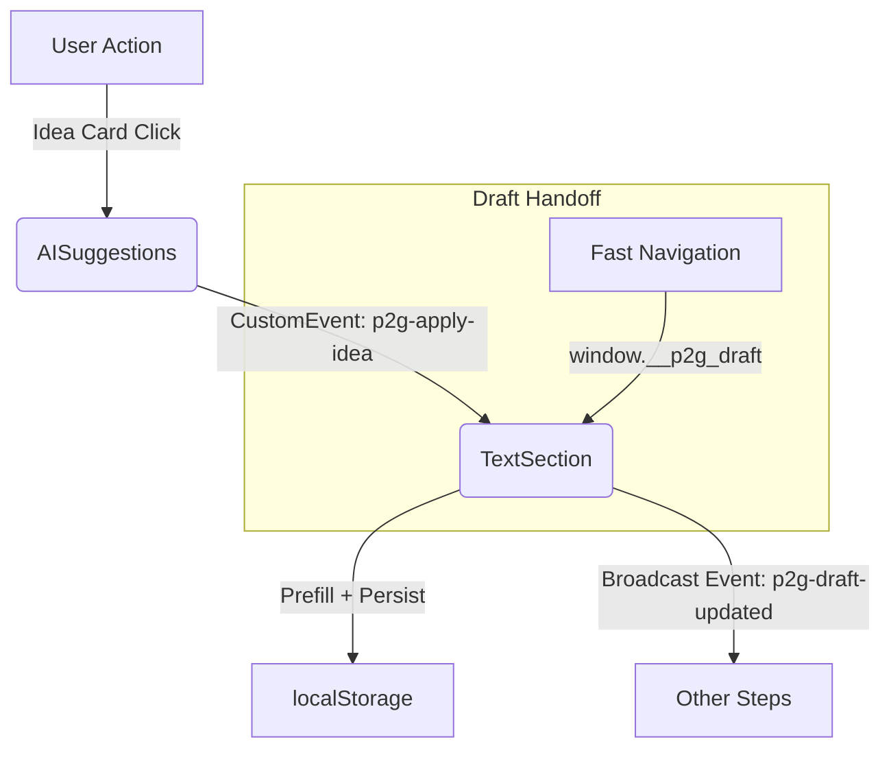

# Post2Grow — “Lav opslag” (Create Post) Flow

This README documents the current state of the “Create Post” flow for Post2Grow. It is a snapshot for designers and developers joining the project mid-stream.

---

## 🖥️ Current User Experience

### 1. Dine platforme (Your Platforms)
- User selects Facebook and/or Instagram (persists selection).

### 2. Få idéer (Get Ideas)
- Prompt panel for post topic.
- “Generér idéer” creates 1–2 suggestions (currently stubbed).
- Suggestions are cards; clicking a card toggles selection (highlights, persists, broadcasts event).
- Selection auto-fills the “Tekst” step, persists, and broadcasts.

### 3. Tekst (Text)
- Selected idea’s title/body auto-filled; chip shows idea title.
- User can edit title/body; changes persist.
- Character counter and Hashtags dock (toggle visibility).
- AI enhancement toggles: Emojis, Hashtags, CTA, Booking link.
- Dropdowns: Tone (Neutral/Venlig/Professionel/Entusiastisk), Length (Som nu/Kortere/Længere).
- “Forbedre med AI” applies changes inline; “Fortryd” pill allows revert (persists immediately).
- If both FB+IG are selected, a small Instagram optimization note appears.

### 4. Udkast / Planlæg & Udgiv (Draft / Schedule & Publish)
- Navigation: Compact “Tilbage / Næste” buttons.
- Step bar always clickable: Idéer · Tekst · Foto/Video · Udkast · Planlæg & Udgiv.

#### Layout
- Slim cards, consistent spacing, no overlap.
- “Tilbage/Næste” buttons outside main cards.

---

## 🔑 Key Files

- `page.tsx` — Hosts step logic, i18n via URL, navigation, and context.
- `components/SelectedPlatformsContext.tsx` — Stores user platform selection.
- `components/IdeasSection/AISuggestions.tsx` — Prompt, suggestions, card selection, spacing fix.
- `components/TextSection.tsx` — Title/body editing, AI enhance stub, Hashtag dock, hydration.
- `components/DinePlatformeBar.tsx` — Platform selection UI.

> If you find `ui/AutoOptimizeTip.tsx` referenced, it’s deprecated; inline messaging now in “Tekst”.

---

## 🗄️ Data Model

**localStorage (persistent source of truth):**
- `p2g_draft_title`, `p2g_draft_body` — current draft
- `p2g_last_idea_title` — last selected idea (chip)
- `__p2g_last_idea_json` — fallback (JSON `{title, body}`)
- `p2g_selected_idea_facebook` / `p2g_selected_idea_instagram` — per-platform idea
- `p2g_photo_idea` — last photo idea (Media step)
- `p2g_lavops_selected` — selected platforms
- `p2g_lavops_active_section` — last step key

**In-memory handoff (ephemeral):**
- `window.__p2g_draft = { title?, body? }` — only for fast navigation; cleared after first use.

**Event “bus” (window events):**
- `p2g-apply-idea` (CustomEvent<{title?, body?}>) — on idea selection.
- `p2g-draft-updated` (Event) — on text save or AI apply/undo.
- `p2g-photo-idea` (Event) — after updating photo idea.

---

## 🔄 Event & Storage Flow (Minimal Diagram)

---

## ⚙️ Critical Behaviors

- **Hydration order:** Tekst uses persisted draft first, then in-memory, then fallback. Clears in-memory after use.
- **No duplicate AI apply:** Inline AI enhancement, undo (“Fortryd”) pill. Persists immediately.
- **Hashtags dock:** Shown only if toggled. Chips are togglable, display-only.

---

## ▶️ How to Run

- Standard Next.js dev flow:
  - `pnpm dev` / `npm run dev` / `yarn dev`
- URL language segment sets i18n:
  - `/da/app/lav-opslag` or `/en/app/lav-opslag`

---

## 🧪 What’s Stubbed vs. Real

- **Idea generation (Ideer):** Local stub; replace with server endpoint, map to `{id, title, body, ...}`.
- **AI enhancement (Tekst):** Client stub; replace `buildEnhanced()` with server AI call, keep apply/undo logic.
- **Media:** If not persisted, store locally (base64 + metadata); broadcast update event.

---

## 📝 UX Copy Note (Danish)

When both FB + IG are selected, show (inline near “Skriver til: …”):

> “Vi bruger tekst til Facebook – AI optimerer til Instagram senere.”

Keep short, single-line, visually secondary.

---

## ✅ Developer Checklist

- [ ] Idea selection toggles highlight, persists, prefills Tekst, and toggles off on reselect.
- [ ] Navigation or reload keeps latest draft.
- [ ] Hashtags dock toggles correctly; chips are togglable, not appended to text.
- [ ] AI enhance applies inline, Fortryd restores, both persist.
- [ ] Platform selection persists; step selector and navigation work as intended.
- [ ] No duplicate “Instagram optimisation later” notes.

---

## 🚩 Near-term TODOs

1. Replace stubs with real AI endpoints (idea generation & text enhancement).
2. Finalize Media persistence (key, event, rehydrate logic).
3. Add IG-optimisation note when both platforms are selected.
4. Debounce localStorage writes while typing (optional).
5. E2E tests: idea apply, AI apply/undo, navigation, reload.

---

## 👋 Onboarding/Hand-off

Jump in by reviewing the key files above and running locally. See checklist and TODOs for immediate priorities.
